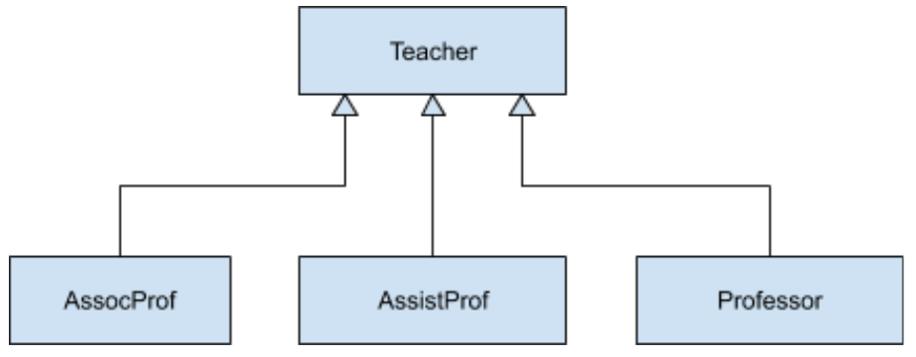

# 3. การทดลองเรื่องการสืบทอดคุณสมบัติ (Inheritance)

ในโลกแห่งความเป็นจริง วัตถุทุกชนิด จะแบ่งปันหรือมีคุณสมบัติและความสามารถร่วมกันอยู่เสมอ ยกตัวอย่างเช่น อาชีพครู ที่มีหลากหลายระดับ แต่มีคุณสมบัติบางอย่างร่วมกันเช่น บทบาทหน้าที่ ความรับผิดชอบ อัตราเงินเดือน เงินประจำตำแหน่ง เป็นต้น ในการทดลองเรื่องการสืบทอดคุณสมบัตินี้ เราจะใช้ลำดับการสืบทอดคุณสมบัติของอาชีพครู เป็นวัตถุในการทดลอง ให้พิจารณารูปต่อไปนี้ 



__การทดลอง__

1. สร้างคลาสชื่อ Teacher ไว้ด้านล่างของคลาส Program
``` C#
class Teacher
{
    // constructor (for initial private/protected variables)
    public Teacher(string name, float billingRate)
    {
        this.name = name;
        this.billingRate = billingRate;
    }
    // figure out the charge based on teacher's rate
    public float CalculateCharge(float hours)
    {
        return (hours * billingRate);
    }
    // return the name of this type
    public string TypeName()
    {
        return ("Teacher");
    }
    private string name;
    protected float billingRate;
}
```
2. แก้ไขเมธอด Main()

``` C#
static void Main(string[] args)
{
    Teacher teacher = new Teacher("Tom", 350f);
    // teacher work for 20Hr/month
    Console.WriteLine("{0} charge = {1}", teacher.TypeName(), teacher.CalculateCharge(20f)); 
    Console.ReadLine();
}
```

รันและสังเกตผลการทำงานของโปรแกรม มีสิ่งใดผิดปกติหรือไม่ อย่างไร
อธิบายการทำงาน ตามที่เข้าใจ

3. ให้สร้างคลาสชื่อ Professor ซึ่งสืบทอดคุณสมบัติจากคลาส Teacher ดังต่อไปนี้

``` C#
class Professor : Teacher
{
    private float emolument;  // เงินประจำตำแหน่ง
    
    public Professor(string name, float billingRate): base(name, billingRate)
    {
    }
   	 
    public Professor(string name, float billingRate, float emolument) 
    : this(name, billingRate)
    {
        this.emolument = emolument;
    }
   	 
    // new function, because it's different than the base version
    public new float CalculateCharge(float hours)
    {
        if (hours < 1.0F)
            hours = 1.0F; // minimum charge.
        return (hours * billingRate) + emolument;
    }
    // new function, because it's different than the base version
    public new string TypeName()
    {
        return ("Professor");
    }
}
```

ในคลาส Professor นี้จะมี constructor จำนวน 2 ตัว คือ ตัวที่ 1 จะพ้องรูปกับคลาส Teacher ส่วนตัวที่ 2 จะมีการเพิ่มพารามิเตอร์มา 1 ตัว สำหรับรองรับการใส่ค่าเงินประจำตำแหน่ง
เนื่องจาก constructor เป็นเมธอดที่ไม่สามารถสืบทอดผ่านการทำ inheritance ได้ ดังนั้นใน derived class  ทุกตัว เราต้องเขียน constructor ไว้เสมอ ซึ่งในคลาส professor นี้มี constructor จำนวน 2 ตัวโดยตัวแรก มีรูปแบบเป็น 

``` C#
public Professor(string name, float billingRate): base(name, billingRate)
```

หมายความว่า constructor ตัวนี้รับพารามิเตอร์ในขณะสร้างวัตถุเป็นจำนวน 2 พารามิเตอร์ แต่เนื่องจากตัวแปรทั้งสองที่จะนำค่าไปเก็บ มี accessor เป็น private และ protected จึงต้องส่งต่อให้ constructor ของ base class ช่วยดำเนินการเก็บลงใน fields ซึ่งวิธีการดังกล่าวทำได้โดยใช้คำสั่ง : base(name, billingRate) ถ้าหากเราไม่เขียน constructor ตัวนี้ ก็จะไม่สามารถนำค่าไปเก็บใน fields ทั้งสองได้ และค่าใน fields ทั้งสองจะมีค่าเป็น default value ส่วน constructor ตัวที่สองจะรับพารามิเตอร์ในขณะสร้างวัตถุเป็นจำนวน 3 พารามิเตอร์ โดยพารามิเตอร์ที่เพิ่มเข้ามาคือเงินประจำตำแหน่ง (float emolument) 

```C#
    public Professor(string name, float billingRate, float emolument) 
    : this(name, billingRate)
```

วิธีการที่ง่ายและตรงไปตรงมาสำหรับ constructor ตัวนี้ก็คือ เราจะนำพารามิเตอร์ตัวที่ 3 ไปเก็บในฟิลด์ private float emolument ส่วนพารามิเตอร์ 2 ตัวแรกจะส่งให้ constructor ตัวที่หนึ่งรับไปดำเนินการ ด้วยคำสั่ง : this(name, billingRate) ซึ่งก็จะทำหน้าที่เรียก constructor ใน base class มาทำงาน

4. แก้ไขเมธอด Main()

``` C#
static void Main(string[] args)
{
    Teacher teacher = new Teacher("Tom", 350f);
    Professor prof = new Professor("Jerry", 500f, 5000f);
    // teacher work 20Hr/month
    Console.WriteLine("{0} charge = {1}", teacher.TypeName(),
        teacher.CalculateCharge(20f));
    // professor work 12Hr/month
    Console.WriteLine("{0} charge = {1}", prof.TypeName(),
        prof.CalculateCharge(12F));
    Console.ReadLine();
}
```
รันและสังเกตผลการทำงานของโปรแกรม มีสิ่งใดผิดปกติหรือไม่ อย่างไร
อธิบายการทำงาน ตามที่เข้าใจ
