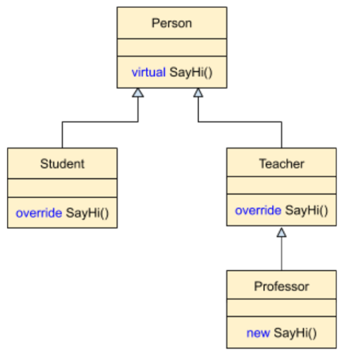

# แบบฝึกหัด
1. ให้เขียนโปรแกรมจาก class diagram ต่อไปนี้



2. แก้ไขฟังก์ชัน Main() ให้เป็นดังต่อไปนี้ 
```C#
static void Main(string[] args)
   {
       Person p = new Professor();
       p.SayHi();
       Console.ReadKey();
   }
```
2.1 ถ้ามีที่ผิดให้ดำเนินการแก้ไขจนรันได้
2.2 บันทึกภาพผลการทำงาน


3. แก้ไขฟังก์ชัน Main() ให้เป็นดังต่อไปนี้ 
```C#
static void Main(string[] args)
   {
       Student p = new Professor();
       p.SayHi();
       Console.ReadKey();
   }
```
3.1 ถ้ามีที่ผิดให้ดำเนินการแก้ไขจนรันได้
3.2 บันทึกภาพผลการทำงาน


4. แก้ไขฟังก์ชัน Main() ให้เป็นดังต่อไปนี้ 
```C#
static void Main(string[] args)
   {
       Teacher t = new Person();
       t.SayHi();
       Console.ReadKey();
   }
```
4.1 ถ้ามีที่ผิดให้ดำเนินการแก้ไขจนรันได้
4.2 บันทึกภาพผลการทำงาน
